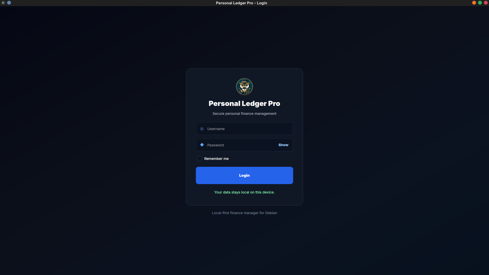
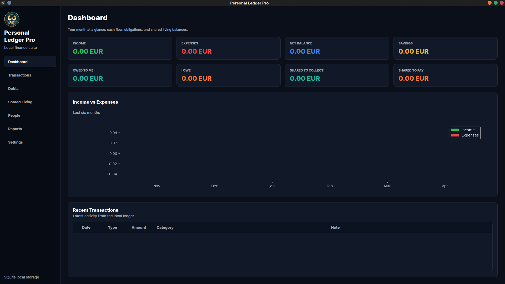
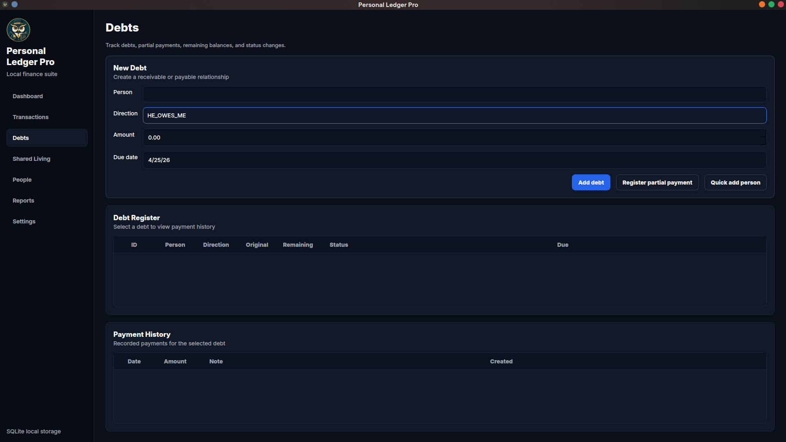
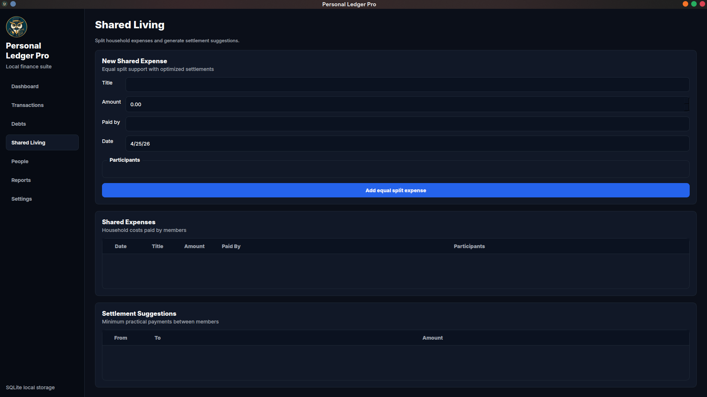
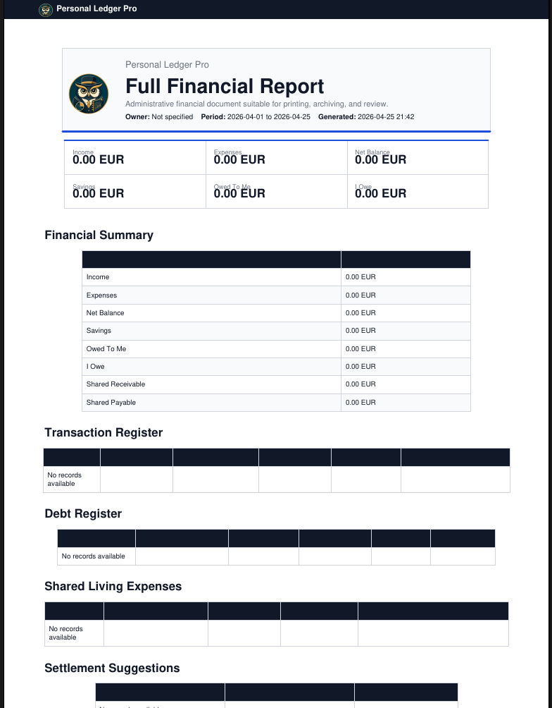

# Personal Ledger Pro


A local-first personal finance, debt, and shared living expense manager for Debian/Linux.

## Overview

Personal Ledger Pro is a Debian/Linux desktop finance manager built with Python, PySide6, SQLite, and SQLAlchemy. It helps manage personal income and expenses, debts, partial debt payments, shared living expenses, settlement suggestions, people, reports, settings, backups, and local login protection.

The application is local-first: financial data is stored in a local SQLite database and is not uploaded to a cloud service by default.

## Features

- Personal income and expense tracking.
- Debt tracking with creditors, debtors, and partial payments.
- Shared living expense splits and settlement suggestions.
- Shared expense row actions for details, editing, and deletion.
- Monthly shared living member detail views for paid amounts, shares, and balances.
- People management for creditors, debtors, shared living members, and the current app owner.
- Owner identity stored as a real `Person` record through `owner_person_id`.
- PDF financial reports with a branded header and app logo.
- Login protection with local credentials.
- Settings center for app, language, report, people, category, payment, backup, and appearance options.
- English, Italian, and Arabic interface language options.
- Backup and restore workflows.
- Database integrity checks.

## Screenshots

 ### Login


### Dashboard


### Debts


### Shared Living


### PDF Report


## Demo

A short Demo GIF will be added soon


## Installation on Debian

Install Python and common Qt runtime prerequisites:

```bash
sudo apt update
sudo apt install -y python3 python3-venv python3-pip libxcb-cursor0
```

Clone the repository and enter the project directory:

```bash
git clone https://github.com/Aboulouafae-it/ledgerhouse.git
cd ledgerhouse
```

Create a virtual environment and install dependencies:

```bash
python3 -m venv .venv
source .venv/bin/activate
python -m pip install --upgrade pip
python -m pip install -r requirements.txt
```

## Running from Source

Run the desktop app from the project root:

```bash
python -m app.main
```

Run tests:

```bash
pytest
```

## Installing Locally on Linux

The repository includes a lightweight Linux launcher and desktop entry under `packaging/linux/`.

```bash
install -D -m 755 packaging/linux/personal-ledger-pro ~/.local/bin/personal-ledger-pro
install -D -m 644 packaging/linux/personal-ledger-pro.desktop ~/.local/share/applications/personal-ledger-pro.desktop
update-desktop-database ~/.local/share/applications || true
```

After installation, launch the app from the desktop menu as **Personal Ledger Pro** or run:

```bash
personal-ledger-pro
```

## Upgrading Without Losing Data

Personal Ledger Pro keeps app code and user data separate. Installing a newer launcher, desktop entry, or source checkout must not replace the local SQLite database in `data/personal_ledger.sqlite3`, nor files in `backups/`, exports, or reports.

On startup, the app applies only safe schema updates: creating missing tables, adding missing columns, adding indexes, and seeding missing default settings. Startup migrations must not drop tables, truncate tables, delete rows, or replace the database file.

Before applying schema updates to an existing SQLite database, the app creates a timestamped safety backup in `backups/` named like:

```text
personal_ledger_pre_migration_YYYYMMDD_HHMMSS.sqlite3
```

If startup migration fails, the app restores the pre-migration backup and shows a clear database upgrade error instead of continuing with a partially upgraded database. To upgrade manually, install the new app files over the old app files, leave `data/` and `backups/` untouched, then launch the app normally.

## Default Login Credentials

The default first-run credentials are:

```text
Username: admin
Password: admin123
```

Change the password after first login.

## Project Structure

```text
app/
  core/            Configuration, database setup, backup, security, and session helpers
  models/          SQLAlchemy ORM models
  repositories/    Database access layer
  services/        Business rules and money calculations
  ui/              PySide6 windows, pages, widgets, and themes
  reports/         PDF report generation
  utils/           Money, date, and text helpers
tests/             Service and utility tests
docs/              Project documentation and media placeholders
data/              Local SQLite database files, ignored by Git
backups/           Local backup files, ignored by Git
```

## Database

Personal Ledger Pro uses a local SQLite database managed through SQLAlchemy models and repositories. The database stores users, people, transactions, debts, debt payments, shared expenses, settlements, settings, report exports, categories, payment methods, accounts, and audit logs.

The owner name in General Settings is not stored as text only. It is synchronized to a real `Person` record, and `owner_person_id` is stored in settings so shared living, dashboard, and reports can identify the current app owner without hardcoded calculation rules.

Financial records should be treated as durable user data. Do not hard delete records without a reviewed retention strategy, and keep migration operations non-destructive.

See [docs/database.md](docs/database.md).

## Reports

PDF reports cover income, expenses, debts, shared living expenses, and full financial summaries. Report identity settings such as owner name, logo path, title prefix, and footer text are managed through app settings. Report total bars are pinned to the bottom of the PDF page when available.

See [docs/reports.md](docs/reports.md).

## Backup

Backups are local files and may contain private financial information. Store backups securely, do not attach real backups to public issues, and test restore behavior with fake or anonymized data.

## Roadmap

See [ROADMAP.md](ROADMAP.md).

## How Claude Can Help

Claude can help review services, write tests, improve documentation, audit migration safety, and reason about money calculations. Claude should not make destructive database changes, weaken authentication, or change financial logic without review.

See [CLAUDE.md](CLAUDE.md).

## Contributing

Contributions are welcome. Please read [CONTRIBUTING.md](CONTRIBUTING.md) before opening an issue or pull request.

## Current Status

Personal Ledger Pro is currently in alpha stage. Core local accounting, shared-living expense management, people management, login protection, PDF reporting, backup/restore, and database checks are implemented. The project is under active development, and future releases will improve packaging, testing, recurring payments, encrypted backups, and multi-currency support.

## Security

Please report vulnerabilities privately and do not upload real financial databases, logs, backups, or screenshots with private data.

See [SECURITY.md](SECURITY.md).

## License

Personal Ledger Pro is licensed under the MIT License. See [LICENSE](LICENSE).

## Disclaimer

Personal Ledger Pro is personal finance software, not professional financial, tax, legal, or accounting advice. Verify reports, balances, and settlement suggestions before relying on them.
